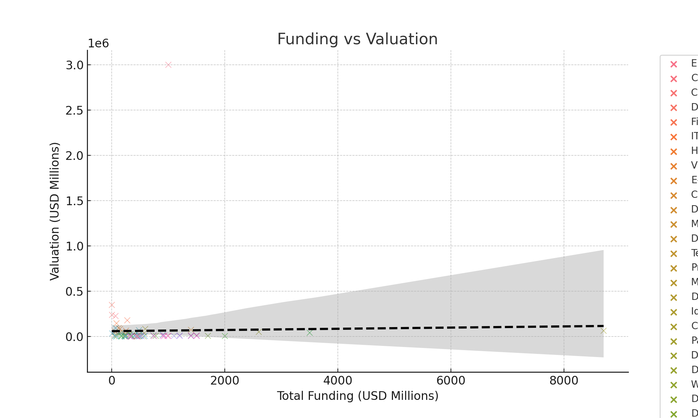

# 🚀 SaaS Market Analysis 2025 — Top 100 Companies

Welcome to the complete data analysis of the **Top 100 SaaS companies in 2025**.  
This project explores funding, valuation, growth, and global distribution to uncover patterns behind the most successful players in the SaaS space.

---

## 🎯 Objective

To identify trends, investment dynamics, industry benchmarks, and emerging unicorns by analyzing key financial and geographic indicators.

---

## 📊 Dataset Overview

- ✅ Cleaned and structured dataset (`data_limpio.csv`)
- 💼 Company-level info: `Valuation`, `ARR`, `Funding`, `Industry`, `Country`, `VCs`, and more
- 🧪 All analysis done using **Python, Pandas, Seaborn, Matplotlib & Plotly**

---

## 🧪 Project Structure

```bash
📁 saas-2025-analysis/
│
├── analisis_saas_2025.ipynb       # Full notebook with code and visualizations
├── reporte_saas_2025.md           # Executive report (Markdown / Notion style)
├── data_limpio.csv                # Clean dataset
├── visualizations/                # 📂 All generated plots (PNG + HTML)
│   ├── scatter_funding_vs_valuation.png
│   ├── boxplot_arr_industry.png
│   ├── heatmap_funding_pais.png
│   ├── mapa_arr_por_pais.html
│   └── ...
```

---

## 🔍 Key Questions Answered

### 1. 📈 Growth & Valuation
- Top 10 companies by Valuation and ARR
- Correlation: `Funding vs Valuation` (+ trend line)
- Valuation efficiency: `Valuation / ARR` ratio
- Outlier detection

### 2. 🏭 Industry Benchmarking
- Average & median KPIs per industry
- Comparative boxplots by sector
- Industry dominance in 2025

### 3. 💸 Investment Analysis
- Relationship: `Investment Rounds vs Valuation`
- Presence of top-tier VCs (Sequoia, a16z, etc.)
- Heatmap: Investment by region

### 4. 🌍 Geographic Insights
- Countries with most SaaS companies
- ARR by continent and country
- Interactive map (Plotly)

### 5. 🦄 Emerging Unicorns
- Filters: young companies with high ARR
- Radar comparison vs industry giants
- CAGR estimation where applicable

---

## 📊 Visual Samples

| 📉 Funding vs Valuation | 🌍 ARR by Country (Map) |
|-------------------------|-------------------------|
|  | 🔗 [Interactive Map](./mapa_arr_por_pais.html) |

---

## 🧠 Insights Highlights

- Some industries are **clearly overvalued** relative to ARR
- 🇺🇸 USA still dominates, but **non-US unicorns** are increasing
- Companies backed by **top-tier VCs** consistently show higher valuations
- High ARR efficiency is concentrated in **horizontal SaaS tools**

---

## 📁 Deliverables

- 📓 `analisis_saas_2025.ipynb` – All Python code & graphs
- 🧾 `reporte_saas_2025.md` – Executive-style report (for Notion or blog)
- 📊 `visualizations/` – All charts in `.png` and `.html`
- 📄 `data_limpio.csv` – Clean dataset

---

## 👨‍💻 Tools Used

- Python 🐍 (Pandas, NumPy, Seaborn, Matplotlib, Plotly)
- Jupyter Notebook
- Markdown / Notion
- Git & GitHub

---

## 💡 Want to explore or extend?

Feel free to fork the repo, clone locally and run the Jupyter Notebook:

```bash
git clone https://github.com/Jacobod1999/saas-2025-analysis.git
cd saas-2025-analysis
jupyter notebook
```

---

## 📬 Contact

Feel free to reach out if you're interested in collaborating or discussing SaaS analytics:

**Jacobo Ochoa**  
🔗 [LinkedIn](https://www.linkedin.com/in/jacobo-ochoa-242b10334/)  
📧 jacoboog1999@gmail.com

---

> “Data is the new oil, and SaaS is the refinery.” 🚀
